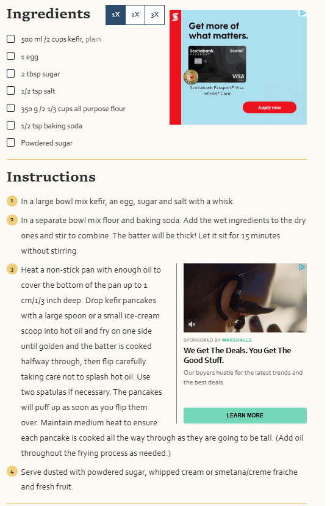

# Fancy Read Me File 
### A little about the recipe
Russian kefir pancakes are not only good for the soul but they are very good for your health. 
Kefir is a __fermented milk__ drink which is very popular in Eastern Slavic countries, it is highly _probiotic_ drink.
### Recipe Ingredients: 
1. Kefir
2. Sugar
3. Salt
4. Egg
5. Flour
6. Baking Soda
7. Powdered Sugar
